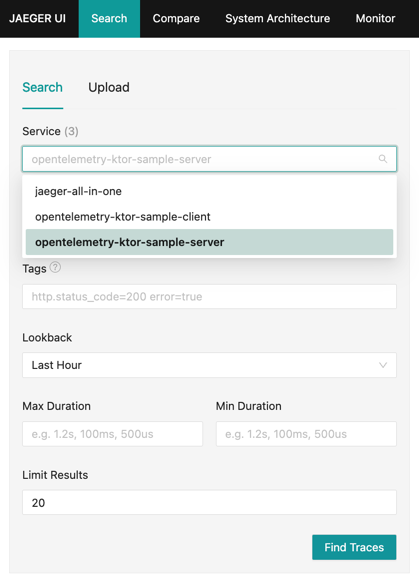
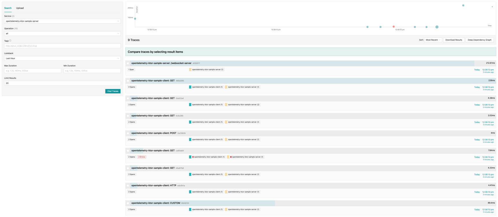
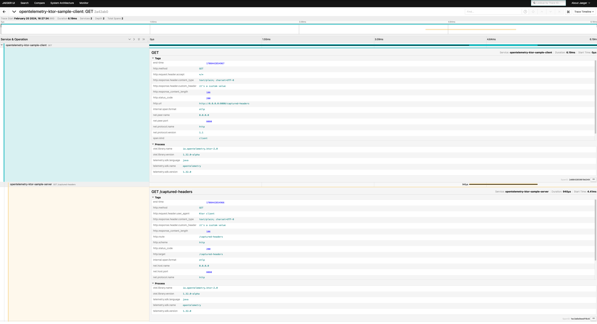

# OpenTelemetry-Ktor Demo

[OpenTelemetry](https://opentelemetry.io/) provides support for Ktor with the `KtorClientTelemetry`and `KtorServerTelemetry`
plugins for the Ktor client and server respectively. For the source code, see
the [repository on GitHub](https://github.com/open-telemetry/opentelemetry-java-instrumentation/tree/main/instrumentation/ktor).

This project contains examples of how to use the `KtorClientTelemetry` and `KtorServerTelemetry` plugins.

You can find examples for the client plugin `KtorClientTelemetry` in
the [extractions](./client/src/main/kotlin/opentelemetry/ktor/example/plugins/opentelemetry) folder. \
And you can find examples for the server plugin `KtorServerTelemetry` in
the [extractions](./server/src/main/kotlin/opentelemetry/ktor/example/plugins/opentelemetry) folder.

## Running

**Note:** You need to have [Docker](https://www.docker.com/) installed and running to run the sample.

To run this sample, execute the following command from the `opentelemetry` directory::

```bash
./gradlew :runWithDocker
```

It will start a `Jaeger` in the docker container (`Jaeger UI` available on http://localhost:16686/search) and
then it will start a `server` on http://localhost:8080/

Then, to run the client, which will send requests to a server, you can execute the following command in
an `opentelemetry` directory:

```bash
./gradlew :client:run
```

**Note:** In this example, we use
an [Autoconfiguration OpenTelemetry instance](https://opentelemetry.io/docs/languages/java/instrumentation/#automatic-configuration),
we set environment variables `OTEL_METRICS_EXPORTER` and `OTEL_EXPORTER_OTLP_ENDPOINT`
in [build.gradle.kts](./build.gradle.kts) file.
You can find more information about these environment variables
in the [OpenTelemetry documentation](https://opentelemetry.io/docs/languages/sdk-configuration/).

Let's check what we will see in the `Jaeger UI` after running the server (with Docker) and the client:

1. We can see two our services that send opentelemetry data: `opentelemetry-ktor-sample-server`
   and `opentelemetry-ktor-sample-client`, and service `jaeger-all-in-one`, it's `Jaeger` tracing some of
   its components:
   
2. If you select `opentelemetry-ktor-sample-server` service and click on **Find traces**, you will see a list of traces:
   
3. If you click on one of those traces, you will be navigated to a screen providing detailed information about the
   selected trace:
   
